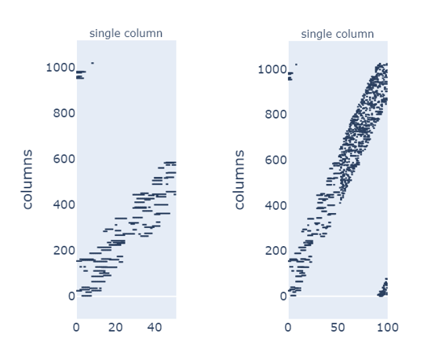
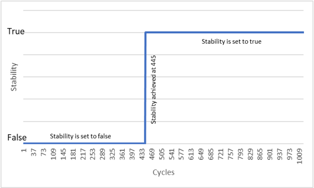

# Project Title: ML 23/24-03 Implement the new Spatial Learning experiment.

### This project implements a new Spatial Learning experiment using the NeoCortexApi. The experiment utilizes the Spatial Pooler (SP) algorithm to learn and predict spatial patterns of binary input vector using C#.

## Overview
* [Getting Started](#getting-started)
* [Problem Statement](#problem-statement)
* [Introduction](#introduction)
* [Encoder](#encoder)
* [HTM Spatial Pooler](#htm-spatial-pooler)
* [Homeostatic Plasticity Controller](#homeostatic-plasticity-controller)
* [Experiment Execution](#experiment-execution)
* [Result Visualization](#result-visualization)
* [Conclusion](#conclusion)

## Getting Started:

Following tools are needed for setting up the project
1. Microsoft visual studio
2. .NET 7.0 target framework
3. Go to the `Samples` folder where NeoCortexApiExperiment is present.
From there run the `Program.cs` file to run the new Spatial Learning Experiment.

```bash
dotnet run --project "../Samples/NeoCortexApiExperiment/NeoCortexApiExperiment.csproj"
```
Path to the Project : [SpatialLearningExperiment](https://github.com/MandarGK/neocortexapi/tree/TheLazyCoders/source/Samples/NeoCortexApiExperiment)

 ## Problem Statement: 

The new Spatial Learning experiment aims to enhance the Spatial Pooling (SP) algorithm by fine-tuning key parameters and optimizing the performance of the HTM Spatial Pooler while addressing specific challenges encountered during the learning phase. The main objectives include implementing persistent storage of Sparse Distributed Representations (SDRs) of inputs in a dictionary structure, detecting stability in SDR generation, investigating the slow activation of mini-columns in the learning phase of SP, tracking iterations to measure stability, and establishing criteria for experiment termination when SDRs remain unchanged for a specified duration. The output format will provide detailed cycle information, including the number of stable iterations, input index, active columns, overlap score, and current SDR representation.


 ## Introduction:

The new Spatial Learning experiment is a demonstration of spatial pattern learning using the NeoCortex API. The experiment showcases how a Spatial Pooler learns spatial patterns through multiple iterations of presented input data. The experiment utilizes the capabilities of the NeoCortex API, implementing algorithms for homeostatic plasticity control and spatial pooling.


 
 ### Encoder:

In this experiment, the scalar encoder was utilized to convert scalar values into encoded representations before presenting them to the Spatial Pooler during the learning phase. As an input, sequence of 0 and 100 values were used. Prior to being fed into the Spatial Pooler, each input value underwent encoding with 200 bits, with each value represented by 15 non-zero bits.

**Encoder Parameters:**
```
int inputBits = 200;
double max = 100;

Dictionary<string, object> settings = new Dictionary<string, object>()
{
    { "W", 15},
    { "N", inputBits},
    { "Radius", -1.0},
    { "MinVal", 0.0},
    { "Periodic", false},
    { "Name", "scalar"},
    { "ClipInput", false},
    { "MaxVal", max}
};

EncoderBase encoder = new ScalarEncoder(settings);
```
 ### HTM Spatial Pooler:
The Spatial Pooler (SP) is a crucial algorithm within the Hierarchical Temporal Memory (HTM) framework designed to learn spatial patterns inspired by the neo-cortex. It is designed to learn the pattern in a few iteration steps and to generate
the SDR of the input. This SDR serves as a compact and efficient representation of the input data, capturing its essential spatial features. Through the process of spatial pooling, the SP identifies and activates a subset of neurons, known as mini-columns, based on the input's spatial patterns, thus facilitating further processing within the HTM network.


**Spatial Pooler Parameters:**

```
int numColumns = 1024;
double minOctOverlapCycles = 0.001;
double maxBoost = 10.0;

HtmConfig cfg = new HtmConfig(new int[] { inputBits }, new int[] { numColumns })
{
    CellsPerColumn = 10,
    MaxBoost = maxBoost,
    DutyCyclePeriod = 1000,
    MinPctOverlapDutyCycles = minOctOverlapCycles,

    GlobalInhibition = false,
    NumActiveColumnsPerInhArea = 0.02 * numColumns,
    PotentialRadius = (int)(0.15 * inputBits),
    LocalAreaDensity = -1,
    ActivationThreshold = 10,

    MaxSynapsesPerSegment = (int)(0.01 * numColumns),
    Random = new ThreadSafeRandom(42),
    StimulusThreshold = 10
};
```

### Homeostatic Plasticity Controller:

The Homeostatic Plasticity Controller (HPC) extends the default Spatial Pooler (SP) algorithm within the Hierarchical Temporal Memory framework. Its primary function is to initiate the SP in a newborn stage at the onset of the learning process. During this phase, the SP initiates boosting and inhibition mechanisms to stimulate mini-columns, allowing for initial instability in the learning process. After a predefined number of iterations, the HPC deactivates boosting and awaits the SP to achieve stability. This approach enables the SP to converge to a stable state, enhancing the quality of learning and facilitating reliable solutions. Additionally, applications can be notified about the SP's state changes, improving adaptability and performance in various contexts.

```
 HomeostaticPlasticityController hpa = new HomeostaticPlasticityController(mem, inputValues.Count * 40,
     (isStable, numPatterns, actColAvg, seenInputs) =>
     {
         // Event should only be fired when entering the stable state.
         // Ideal SP should never enter instable state after stable state.
         if (isStable == false)
         {
             Debug.WriteLine($"INSTABLE STATE");
             isInStableState = false;
         }
         else
         {
             Debug.WriteLine($"STABLE STATE");
             isInStableState = true;
         }
     });
```
 ## Experiment Execution:

### The steps involved in the experiment are as follows:

**Input Generation**: Random input values are generated for the experiment.
```
double max = 100;

List<double> inputValues = new List<double>();
for (int i = 0; i < (int)max; i++)
{
   inputValues.Add((double)i);
}
```

**SP Initialization**: The Spatial Pooler is initialized with the specified configuration and encoder.
```
SpatialPooler sp = new SpatialPooler(hpa);

sp.Init(mem, new DistributedMemory() { ColumnDictionary = new InMemoryDistributedDictionary<int, NeoCortexApi.Entities.Column>(1) });
```

**Learning Process and Stability Detection**: The experiment iterates over a defined number of cycles, presenting input values to the SP and observing its behavior. The SP adjusts its connections and activation patterns based on the input.
A Homeostatic Plasticity Controller monitors the SP's stability. Once the SP enters a stable state, it notifies the experiment, indicating that learning is complete and exits the experiment according to the specified condition. Also, similarity between consecutive SDRs are calculated to measure stability.

```
public HomeostaticPlasticityController(Connections htmMemory,
                                        int minCycles, 
                                        Action<bool, int, double, int> 
                                        onStabilityStatusChanged, 
                                        int numOfCyclesToWaitOnChange = 100,
                                        double requiredSimilarityThreshold = 0.97)
{ }
```

**Output SDR Recording**: During stable periods, the experiment records the SDRs generated by the SP for each input value and is stored in the dictionary.
```
Dictionary<int, List<List<int>>> SdrDictionary = new Dictionary<int, List<List<int>>>();
```

## Result Visualization:

The Spatial Pooler's output for input index 0 at cycle 544  and the resulting Sparse Distributed Representation, showcasing active mini-columns.

```
[cycle=0544, N=503 , stablecycles =99, i=0, cols=20, s=100] SDR: 7, 24, 29, 43, 46, 59, 62, 70, 102, 112, 114, 116, 118, 146, 148, 154, 155, 953, 960, 1012
```
Breakdown of the output representation:

**cycle=0544**: This indicates the cycle number, where the current cycle is 544.   

**N=503**: This indicates the number of iterations during which the SDR for the input remained unchanged or stable, which is 503.
 
**StableCycles=99**: This represents the number of consecutive stable cycles leading up to the current cycle, which is 99.

**i=0**: This indicates the input and iteration number within the current cycle, which is 0.

**cols=20**: This signifies the total number of mini-columns that are active in the current iteration.

**s=100**: This represents the similarity between the SDR of the current cycle and the SDR of the previous cycle for the input. A value of 100 indicates a perfect match between the two representations, while lower values indicate less similarity.

**SDR: 7, 24, 29, ... 1012**: This is the Sparse Distributed Representation (SDR) generated by the Spatial Pooler for the current input value. The numbers represent the indices of the active mini-columns in the SDR.


### Addressing Slow Activation of Mini-Columns
The spatial learning experiment revealed an initial challenge where the Spatial Pooler (SP) struggled to generate accurate Sparse Distributed Representations (SDRs) for inputs above a certain threshold. This issue was traced back to an indexing problem within the SP algorithm, particularly affecting mini-columns associated with inputs greater than 50. These mini-columns failed to activate, leading to an absence of overlaps in the SDRs, which impaired the learning process.

To address this, a new method called `SetUpdatedPermanences` was implemented. This method corrected the indexing issue, enabling the SP to properly activate mini-columns based on the input patterns. As a result, the SP now successfully generates SDRs for the entire range of inputs during the learning phase, including those exceeding 50 as depicted in Figure 1.

<p align="center">
  
  <br>
  <em>Figure 1: <i>Representation of SDRs generated for only input 0 to 50 due to incorrect indexing (left) and SDRs generated for input 0 to 99 with proper indexing (right). The horizontal axis shows the index of the input. The vertical axis shows the SDR. Every blue dot represents the active mini column.</i></em>
</p>

### Ensuring Consistent Stability
Stability in the SDRs is crucial for the reliable performance of the Spatial Pooler. The experiment demonstrated that once the SP system achieves a stable state, no further changes are observed in the SDRs, ensuring consistent and reliable output.

The system’s stability was monitored using a variable ⁠ isInStableState ⁠. The experiment was designed to terminate after confirming that SDRs remained unchanged for a specified number of iterations (100 cycles in this case), ensuring that the system had indeed reached a stable state.

Once stability is detected, the experiment continues for 100 additional cycles, tracked by a counter called `StableCyclesElapsed`. This counter increments if the system remains stable and resets if it becomes unstable. If the counter reaches the `LoopBreakerThreshold` (set to 100 cycles), the experiment exits, confirming stability.

The Figure 2 Represents the stability trend over 1000 cycles, with the stable state being reached at cycle 445. From this point onwards, the system maintains a constant behavior, validating the effectiveness of the solution in achieving stability.

<p align="center">
  
  <br>
  <em>Figure 2: <i>Stability trends over 1000 cycles with Stable State reached at cycle 445 and constant behavior thereafter..</i></em>
</p>

